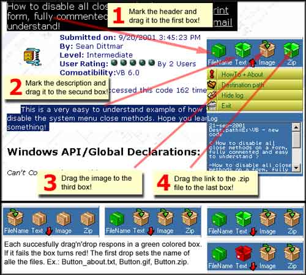



## PSC Downloader 1\.0

### Description

A small prog that helps you download sourcecode from PSC. It uses drag'n'drop. For more info see the text files included the .zip-file.

New version available here at PSC: http://www.planetsourcecode.com/vb/scripts/showcode.asp?txtCodeId=58582&lngWId=1
 
### More Info
 
I use a userControl posted here on PSC by KDC. The project are named 'gradient button'. You can get the source code here:

http://www.planet-source-code.com/xq/ASP/txtCodeId.27225/lngWId.1/qx/vb/scripts/ShowCode.htm

             |
---                |---
**Submitted On**   |2001-09-24 01:01:18
**By**             |[Thomas Hannibal](https://github.com/Planet-Source-Code/PSCIndex/blob/master/ByAuthor/thomas-hannibal.md)
**Level**          |Intermediate
**User Rating**    |4.4 (35 globes from 8 users)
**Compatibility**  |VB 6\.0
**Category**       |[Complete Applications](https://github.com/Planet-Source-Code/PSCIndex/blob/master/ByCategory/complete-applications__1-27.md)
**World**          |[Visual Basic](https://github.com/Planet-Source-Code/PSCIndex/blob/master/ByWorld/visual-basic.md)
**Archive File**   |[PSC Downlo2871710122001\.zip](https://github.com/Planet-Source-Code/thomas-hannibal-psc-downloader-1-0__1-27782/archive/master.zip)

